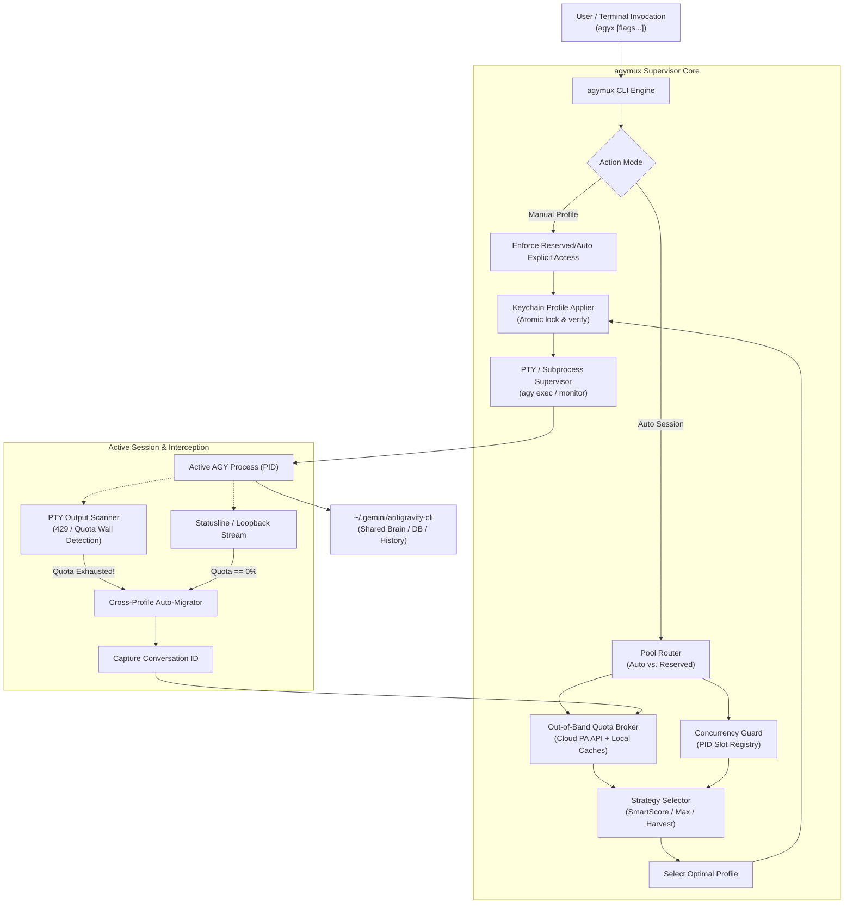
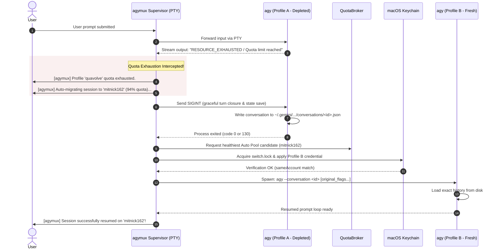

# Architecture Design Document: `agymux` (`agyx`)
## Smart Multi-Profile Dispatcher, Quota Manager & Concurrency Governor for Antigravity CLI

**Status**: Proposal / Under Review  
**Date**: September 2026  
**Target Executable Names**: `agymux` (formal) / `agyx` (daily driver CLI alias)  
**Reference Base**: `../switcher/` (Agy Switchboard & `AgyCore`)  
**Workspace**: `/Volumes/External/dev/common/agentfusion/agy-cli`  

---

## 1. Executive Summary & Vision

The Antigravity CLI (`agy`) binds to the active Google identity configured in the macOS Keychain (`service: gemini, account: antigravity`). Power users with multi-account setups frequently hit the 5-hour rolling rate limits or weekly quotas on individual profiles, while other captured profiles sit idle. Furthermore, running multiple parallel CLI sessions on the same profile rapidly exhausts that profile's rate limits (HTTP 429 `RESOURCE_EXHAUSTED`) due to quota competition.

`agymux` (aliased as `agyx`) is a high-performance, drop-in CLI wrapper that transforms single-account `agy` into an intelligent, multi-account agent multiplexer:

1. **Auto-Profile Selection at Session Start**: Transparently evaluates candidate profiles and activates the healthiest one before launching `agy`.
2. **Dual-Pool Categorization**: Isolates an operator's primary/VIP accounts into a **Reserved Pool** (manual access only) while dynamically cycling commodity accounts in the **Auto Pool**.
3. **Multi-Window Quota Choosing Strategies**: Chooses profiles using customizable heuristics (Greedy Max Headroom, Window Harvesting, Water-Leveling, or Composite Smart Scoring).
4. **Concurrency Guard & Slot Management**: Enforces a strict/configurable limit on active CLI processes per profile, eliminating intra-profile quota competition.
5. **Cross-Profile Session Migration & Resumption**: When an active session encounters a quota wall mid-flight, `agymux` gracefully traps the error, flushes the conversation state, rotates to a fresh profile, and relaunches `agy --conversation <id>` with zero loss of context or artifacts.

---

## 2. Deep Dive: Insights & Reusable Primitives from `../switcher/`

A deep review of `../switcher/` reveals key architectural foundations that `agymux` leverages:

```
┌─────────────────────────────────────────────────────────────────────────────┐
│                           AgyCore / Switchboard                             │
├─────────────────────────────────────────────────────────────────────────────┤
│  • Storage: Profiles in ~/.aisw/profiles/antigravity/<name>/                │
│             keyring-secret.json (hex / go-keyring-base64 JSON).             │
│  • Keychain: Direct Apple-signed /usr/bin/security -i manipulation.         │
│  • Isolation: ~/.gemini/antigravity-cli (brain, conversations, history) is  │
│               shared across all profiles! Conversations are profile-agnostic│
│  • Direct Cloud Quota: Direct POST to cloudcode-pa.googleapis.com using     │
│                        decoded OAuth refresh tokens (no pre-switch needed). │
│  • Lock Safety: File locks (switch.lock) + rollback recovery journals.      │
│  • Session Tracking: Managed sessions recorded in per-PID JSON files.       │
└─────────────────────────────────────────────────────────────────────────────┘
```

### Key Technical Discoveries:
1. **Conversations are 100% Profile-Agnostic**:
   `~/.gemini/antigravity-cli/conversations/<id>.json` and `~/.gemini/antigravity-cli/brain/<id>/` are shared across all identities. Any AGY process authenticated as *any* Google profile can open and continue *any* conversation ID via `agy --conversation <id>`.
2. **Quota is Queryable Out-of-Band**:
   `QuotaBroker.swift` demonstrates that Google's `retrieveUserQuotaSummary` endpoint can be queried for **any** profile using its stored `refresh_token` and client ID `1071006060591-tmhssin2h21lcre235vtolojh4g403ep.apps.googleusercontent.com`. We do **not** need to switch Keychain to check quotas of dormant profiles.
3. **In-Flight Session Memory vs. Keychain State**:
   Existing running AGY sessions hold credentials in memory. Switching Keychain changes the credential for future child processes. However, to maintain safety against late token refreshes, session lifetimes and switch locks must be coordinated.

---

## 3. System Architecture & Component Model



---

## 4. Pool Categorization: Auto Pool vs. Reserved Pool

The system maintains a pool configuration file at `~/.agymux/pools.json` (integrated with `~/.aisw/config.json`):

### 4.1 Reserved Pool
- **Purpose**: Dedicated for sensitive, billing-critical, personal, or high-priority accounts (e.g., `charleswongjy`).
- **Policy**:
  - **Strictly manual**: Never chosen automatically by `agymux` under routine launches.
  - **Immune to auto-drain**: Automated batch scripts and routine CLI sessions cannot deplete its quota.
  - **Explicit invocation**: Must be called via `agyx --profile <name>` or `agyx reserved use <name>`.
  - **Fallback option**: Can be configured to serve as an emergency fallback with an interactive confirmation prompt (`"All auto profiles depleted. Use reserved profile 'charleswongjy'? [y/N]"`).

### 4.2 Auto Pool
- **Purpose**: Commodity accounts that should be drained, rotated, and utilized to their maximum potential (e.g., `quavolve`, `mitnick162`, `mitnick915`, `everestmountaineer`).
- **Policy**:
  - Automatically evaluated on every `agyx` launch.
  - Dynamically sorted according to the active Quota Choosing Strategy.
  - Subject to concurrency slot limits to prevent resource contention.

### 4.3 Pool Configuration Schema (`~/.agymux/pools.json`)
```json
{
  "version": 1,
  "default_strategy": "smart",
  "default_model": "gemini-3.8-flash-high",
  "max_active_threads_per_profile": 3,
  "reserved_fallback_mode": "prompt",
  "pools": {
    "reserved": [
      {
        "name": "current",
        "email": "user.primary@example.com",
        "description": "Primary account - reserved for urgent/manual tasks",
        "priority": 100,
        "max_threads": 3
      }
    ],
    "auto": [
      {
        "name": "profile-alpha",
        "email": "account1@example.com",
        "priority": 50,
        "max_threads": 3
      },
      {
        "name": "profile-beta",
        "email": "account2@example.com",
        "priority": 50,
        "max_threads": 3
      },
      {
        "name": "profile-gamma",
        "email": "account3@example.com",
        "priority": 50,
        "max_threads": 3
      },
      {
        "name": "profile-delta",
        "email": "account4@example.com",
        "priority": 50,
        "max_threads": 3
      },
      {
        "name": "profile-epsilon",
        "email": "account5@example.com",
        "priority": 50,
        "max_threads": 3
      }
    ]
  }
}
```

---

## 5. Quota Choosing Strategies

Antigravity operates with two distinct model quota buckets:
- **Gemini Family**: 5-hour rolling window ($Q_{G,5h}$) and Weekly window ($Q_{G,w}$).
- **Third-Party Family (Claude / GPT)**: 5-hour rolling window ($Q_{3P,5h}$) and Weekly window ($Q_{3P,w}$).

`agymux` provides 5 configurable strategies:

```
┌─────────────────────────────────────────────────────────────────────────────┐
│                        Quota Choosing Strategies                            │
├───────────────────┬─────────────────────────────────────────────────────────┤
│ Strategy          │ Selection Rule & Target Optimization                    │
├───────────────────┼─────────────────────────────────────────────────────────┤
│ 1. Max-Headroom   │ argmax min(Q_5h, Q_weekly)                              │
│    (Greedy Max)   │ Best for long, uninterrupted coding sessions.           │
├───────────────────┼─────────────────────────────────────────────────────────┤
│ 2. Window-Harvest │ argmin(Time_to_Reset) where Q_5h >= 15%                 │
│    (Perishable)   │ Burns quota expiring soonest so tokens aren't wasted.   │
├───────────────────┼─────────────────────────────────────────────────────────┤
│ 3. Water-Leveling │ Evenly drains all accounts in parallel.                 │
│    (Balanced)     │ Keeps all profiles at roughly identical % remaining.    │
├───────────────────┼─────────────────────────────────────────────────────────┤
│ 4. Model-Targeted │ Evaluates Q_3P if --model=claude*, else Q_Gemini.        │
│    (Adaptive)     │ Avoids routing to a profile with 0% in requested model. │
├───────────────────┼─────────────────────────────────────────────────────────┤
│ 5. SmartScore     │ Composite weighted scoring function (Recommended).      │
│    (Default)      │ Quota (50%) + Reset Urgency (20%) - Concurrency (30%).  │
└───────────────────┴─────────────────────────────────────────────────────────┘
```

### Strategy Mathematical Formulations:

#### Strategy 1: Max Headroom (High-Watermark)
Select the profile with the largest remaining bottleneck buffer:
$$P^* = \arg\max_{P \in \text{AutoPool}, C(P) < M(P)} \left[ \min\left(Q_{5h}(P), Q_{\text{weekly}}(P)\right) \right]$$
*Ideal for*: Heavy agents running deep reasoning loops that must avoid interruption.

#### Strategy 2: Window Harvesting (Perishable Quota First)
If Profile A has 25% quota remaining that resets in 20 minutes, and Profile B has 90% that resets in 4 hours, routing to Profile A consumes tokens that would otherwise vanish upon reset:
$$P^* = \arg\min_{P \in \mathcal{E}} \left( t_{\text{reset}}(P) - t_{\text{now}} \right)$$
where $\mathcal{E} = \{ P \in \text{AutoPool} \mid Q_{5h}(P) \ge 0.15 \land (t_{\text{reset}}(P) - t_{\text{now}}) \le 60\text{ min} \land C(P) < M(P) \}$. If $\mathcal{E} = \emptyset$, falls back to Strategy 1.

#### Strategy 3: Water-Leveling (Balanced Drain)
Maintains equalized quota consumption across the fleet:
$$P^* = \arg\max_{P \in \text{AutoPool}} \left( \frac{Q_{5h}(P)}{\overline{Q}_{5h}} - \alpha \cdot C(P) \right)$$
*Ideal for*: Multi-person teams or background automations wanting uniform availability.

#### Strategy 4: Model-Targeted Adaptive
Inspects the CLI argument vector `argv`:
- If `--model claude...` or `--model gpt...`: evaluates strictly $Q_{3P,5h}$ and $Q_{3P,w}$.
- If `--model gemini...`: evaluates strictly $Q_{G,5h}$ and $Q_{G,w}$.
- Prevents the common failure mode where an account with 100% Gemini quota but 0% Claude quota is mistakenly selected for a Claude session.

#### Strategy 5: Composite SmartScore (Default Production Rule)
Computes a normalized score $S(P) \in [0, 100]$:
$$S(P) = w_q \cdot Q_{\text{model}}(P) + w_u \cdot U_{\text{reset}}(P) - w_c \cdot \left(\frac{C(P)}{M(P)}\right) + B_{\text{affinity}}(P)$$
- **Quota Factor ($w_q = 50$)**: Bottleneck remaining percentage $\min(Q_{5h}, Q_w)$.
- **Urgency Bonus ($w_u = 20$)**: $1.0 - \frac{t_{\text{reset}} - t_{\text{now}}}{5\text{ hours}}$ if $Q_{5h} > 15\%$, else $0$.
- **Concurrency Penalty ($w_c = 30$)**: Ratio of active threads to max slots.
- **Affinity Bonus ($B_{\text{affinity}} = 5$)**: Minor boost if profile is already active in Keychain (saves an unnecessary Keychain write).
- **Hard Exclusions**: Profiles with $Q_{5h} < 5\%$ or $C(P) \ge M(P)$ receive $S(P) = -\infty$.

---

## 6. Concurrency Guard & "Minimum Active CLI Threads"

### 6.1 The Competition Problem
When two `agy` CLI processes run on the same profile simultaneously:
1. They share the same 5-hour rolling pool, causing premature exhaustion.
2. They share backend TPM/RPM limits, resulting in mutual HTTP 429 throttling.
3. If one process triggers a token refresh while the other is executing, race conditions can occur.

### 6.2 Dual Enforcement Architecture

```
                                  [ New Session Request ]
                                             │
                                             ▼
                      ┌──────────────────────────────────────────────┐
                      │ Concurrency Guard Check                      │
                      │ Reads ~/.agymux/sessions/*.json              │
                      │ Prunes dead PIDs (kill -0 + proc_pidpath)    │
                      └──────────────────────┬───────────────────────┘
                                             │
                       Is any Auto profile below max_threads (e.g. 1)?
                                     ├── YES ──► Route to best profile with 0 active threads
                                     └── NO
                                          │
                        Are all Auto profiles at capacity?
                                     ├── Allow Overflow (if soft_limit=true)
                                     ├── Queue / Wait for slot
                                     └── Prompt: "All slots busy. Use Reserved pool? [y/N]"
```

1. **Active Thread Slot Limit (`max_active_threads_per_profile`)**:
   - **Default: 1 active thread per profile**.
   - Ensures strict 1:1 mapping between active CLI sessions and distinct Google accounts whenever possible.
2. **Fair Thread Distribution**:
   - Profiles with 0 active threads are prioritized over profiles with active threads, regardless of small quota differences.
3. **Session Registry & Heartbeat / Reaper (`~/.agymux/sessions/<pid>.json`)**:
   - Every `agymux` instance writes its launch record:
     ```json
     {
       "pid": 48201,
       "profile": "quavolve",
       "conversation_id": "19b40d7e-81a3-482e-8c85-9583886bea2a",
       "started_at": "2026-09-12T09:49:15Z",
       "cwd": "/Volumes/External/dev/common/agentfusion/agy-cli",
       "command_line": ["--mode", "plan"]
     }
     ```
   - On every launch or status check, `agymux` prunes the registry using `kill(pid, 0)` and `proc_pidpath(pid)`. Zombie processes and killed sessions are instantly reclaimed.

---

## 7. Cross-Profile Mid-Session Resumption (Handling Quota Limits)

This is the most critical user requirement: **What happens when a session hits a quota wall while actively running?**

### 7.1 Why Seamless Resumption is Feasible in AGY
In many CLIs, switching accounts destroys conversation state. In Antigravity:
1. Conversations are indexed globally by UUID in `~/.gemini/antigravity-cli/conversations/<uuid>.json`.
2. Model context, user prompts, assistant turns, and workspace artifacts reside in `~/.gemini/antigravity-cli/brain/<uuid>/`.
3. Running `agy --conversation <uuid>` or `agy -c` restores the conversation **identically**, regardless of which account launches it.

### 7.2 Detection of Quota Exhaustion
`agymux` supervises the child `agy` process in PTY mode and detects quota limits via three redundant channels:

```
[Channel 1: PTY Terminal Stream Scanner]
  Interprets raw terminal output for backend error signatures:
  • "Quota exceeded"
  • "RESOURCE_EXHAUSTED"
  • "exhausted your 5-hour quota"
  • "Your quota will reset in"

[Channel 2: Statusline Hook Cache Watcher]
  Watches ~/Library/Caches/AgySwitcher/quota/statusline/<pid>.json
  When payload.quota.*.remaining_fraction == 0.0 -> Triggers Alert.

[Channel 3: Exit Code & Intercept Trap]
  When agy terminates with non-zero exit or unhandled API error.
```

### 7.3 The 6-Step Migration Handshake



### 7.4 Auto-Prompt Replay
When a turn was interrupted by quota exhaustion:
- If the prompt failed before generating a response, `agymux` tracks the pending prompt string in its buffer.
- Upon relaunching under Profile B, `agymux` can optionally re-inject the pending prompt automatically so the user does not have to re-type it.

---

## 8. CLI Command Specification & Ergonomics

### 8.1 Primary Invocations
```bash
# Transparent drop-in usage (auto-selects best profile from Auto Pool)
agyx

# Resume most recent conversation on the healthiest profile
agyx -c
agyx --continue

# Resume a specific conversation ID
agyx --conversation 19b40d7e-81a3-482e-8c85-9583886bea2a

# Non-interactive print mode with auto-retry across profiles on quota hit
agyx -p "Review this PR"

# Explicitly use a Reserved Pool account (bypasses auto-pool selection)
agyx --profile charleswongjy
```

### 8.2 Pool & Strategy Management Commands
```bash
# View dashboard of all profiles, pools, active threads, and quotas
agyx pool status

# Output example:
# POOL        PROFILE             GEMINI 5H   CLAUDE 5H   RESET IN    ACTIVE SLOTS  STATUS
# [reserved]  charleswongjy       92%         85%         3h 12m      0 / 2         IDLE (MANUAL ONLY)
# [auto]      quavolve            0% (DEP)    12%         42m         0 / 1         DEPLETED
# [auto]      mitnick162          95%         90%         4h 45m      1 / 1         BUSY (PID 48201)
# [auto]      mitnick915          88%         80%         2h 10m      0 / 1         READY (NEXT UP)
# [auto]      everestmountaineer  64%         55%         1h 15m      0 / 1         READY

# Move profiles between pools
agyx pool set-category charleswongjy reserved
agyx pool set-category everestmountaineer auto

# Switch choosing strategy on the fly
agyx config set strategy [smart|max-headroom|harvest|balanced|model-adaptive]

# Test which profile would be chosen right now
agyx doctor --dry-run
```

---

## 9. Failure Modes, Safety Invariants & Edge Cases

| Failure Mode | Impact | Mitigation in `agymux` |
| :--- | :--- | :--- |
| **All Auto Pool accounts exhausted** | No profile in Auto Pool has $>5\%$ quota. | Warns operator with time remaining until the earliest reset. Offers interactive choice to wait or unlock a Reserved profile. |
| **Keychain lock contention** | Another process is switching credentials. | Uses POSIX `flock(switch.lock)` with a 30s timeout and clear diagnostic output. |
| **Expired OAuth token on dormant profile** | Direct Cloud Quota query fails. | Uses `refresh_token` with Google OAuth token endpoint to fetch fresh `access_token` automatically (from `QuotaBroker`). |
| **Sudden SIGKILL of running session** | Orphaned record in `sessions/*.json`. | Startup reaper scans all registered PIDs with `kill(pid, 0)` and deletes dead records before scheduling. |
| **Antigravity Desktop open during switch** | Desktop app shares Keychain and might clash. | Detects desktop PID; coordinates safe restart or warns user (inherits Switchboard's `desktop-session.json` protocol). |

---

## 10. Implementation Plan & Tech Stack

### 10.1 Tech Stack Choice: Native Swift CLI
- **Language**: **Swift 6** (matching `switcher/Sources`).
- **Rationale**:
  - Sub-15ms cold startup (critical for an interactive CLI wrapper; Python startup takes ~150-250ms).
  - Reuses existing `AgyCore` and `AgySecurityCLI` modules without rewriting Keychain logic or security bindings.
  - Native POSIX PTY bindings (`forkpty`, `termios`, `ioctl`) for seamless terminal stream interception.
  - Generates a standalone single binary `agymux` installed in `/opt/homebrew/bin` or `~/.local/bin`.
- **Python Integration**:
  - Provides Python bindings / CLI shim in `agentfusion` (`src/clillm/agy_router.py`) to allow AgentFusion web/CLI orchestrator to invoke `agymux` programmatically.

### 10.2 Phased Roadmap
- **Phase 1: Foundations & Pool Store**
  - Create package in `agy-cli/` referencing `AgyCore`.
  - Implement `PoolManager` (`~/.agymux/pools.json`) with auto vs. reserved separation.
  - Implement `SessionRegistry` (PID tracking & slot governor).
- **Phase 2: Quota Selection & Strategies**
  - Port `QuotaBroker` out-of-band token query into `agymux`.
  - Implement the 5 quota strategies and scoring engine.
  - Add `agyx pool status` and `agyx doctor`.
- **Phase 3: Supervisor & PTY Migration**
  - Implement PTY spawner and terminal pass-through.
  - Implement quota exhaustion pattern matcher (stream scanner).
  - Implement 6-step cross-profile migration protocol.
- **Phase 4: Verification & E2E Testing**
  - Test multi-terminal concurrency (slot locking).
  - Test simulated quota walls and seamless conversation handoff.
  - Symlink `agyx` to PATH.

---

## 11. Design Review Questions for Operator

Before proceeding to code implementation, please review the following design choices:

1. **Naming**: Do you prefer **`agymux`** (formal binary) with alias **`agyx`**, or a different name (e.g. `agypool`, `agysmart`, `agyw`)?
2. **Default Concurrency**: Is `1` active CLI session per profile appropriate as the default slot ceiling, or do you prefer `2`?
3. **Emergency Fallback**: If all profiles in the Auto Pool are depleted, should `agymux` prompt to use a Reserved account (e.g. `charleswongjy`), or strictly halt and show the countdown until the nearest Auto account resets?
